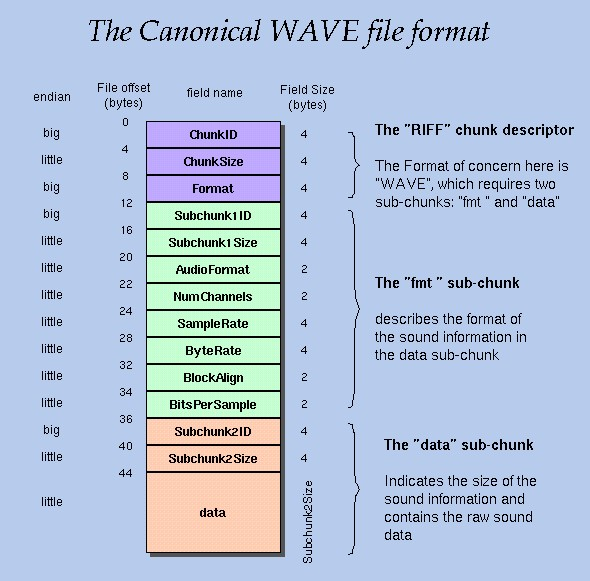

**[EN-US]**
# .WAV files Handler

This repository contains a console application that I developed alone in 2020, during my high school years, in the subject of **Elements of Programming**. The idea of the project was to create a WAV file handler where you could:

- Display the file information (metadata)
- Modify the volume of the file
- Cut a part of the file
- Play the content (This was the challenge of the task - not mandatory)

## Understanding the structure of the .WAV file

To be able to do this project, it was essential to understand the structure of a .WAV file, since all the code is based on the structure pattern already defined for files of this extension.

I will leave attached at the [end of this README](#wav-structure) an illustration of the structure and divisions of a .WAV file, as provided by my professor at the timee.

---

**[PT-BR]**
# Manipulador de arquivos .WAV

Este repositório contém uma aplicação console que desenvolvi sozinho em 2020, na disciplina de **Elementos de Programação**. A ideia do projeto era criar um manipulador de arquivos .WAV, onde fosse possível:

- Exibir as informações do arquivo (metadados)
- Modificar o volume do arquivo
- Recortar um trecho do arquivo
- Reproduzir o conteúdo (Isto era o desafio da tarefa - não obrigatório)

## Entendendo a estrutura do arquivo .WAV

Para conseguir realizar este projeto, foi essencial entender a estrutura de um arquivo .WAV, uma vez que todo o código baseia-se no padrão de estrutura já definido para arquivos desta extensão.

Irei deixar anexado ao [final deste README](#wav-structure) uma ilustração da estrutura e divisões de um arquivo .WAV, conforme repassado pelo meu professor na época.

--- 

## .WAV Structure:

     
    
     
    <a href="http://soundfile.sapp.org/doc/WaveFormat/"><strong>Reference</strong></a>

